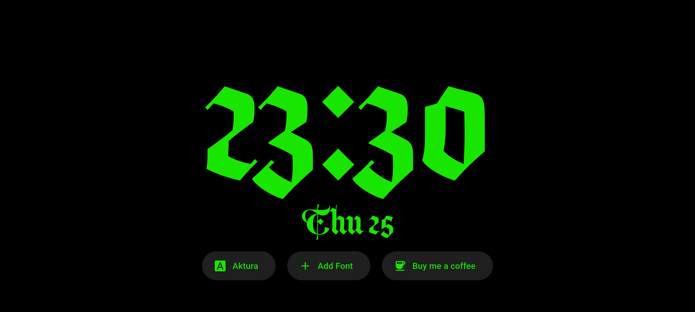

# My Clock

&nbsp;&nbsp;

## About
I recently started using my phone as an 'Standby Clock'. However, when I went to search for any android apps, most of these apps had ads. Now as much as I like supporting developers work, all I wanted was a simple clock standby clock app, with no ads.

**My Clock** is a lightweight Flutter-based app which displays the time and date in landscape mode with a wakelock enabled, keeping your screen on without interruption. The theme of your clock is directly tied to the android theme color.

## Installation

While you can always go ahead, build and install the apk from this code yourself. I also provide apk files on 

* wfdef

## How to Use

* The watch by default shows the clock face in 24hr time format paired with the day and date.

* If you tap anywhere on the screen, you get three buttons; first one is to change between the font types, the second one is to add fonts(in .otf and .ttf formats) and the third is a link to [My donate page](https://buymeacoffee.com/adityawardhanm) 

Pretty simple.

## Future Plans

* I do not intend to revisit this project until I wish to add a feature. However, I am open to feature suggestions.

* If there's enough interest, I may also publish it to the Google Play Store.

## License 

This project is licensed under the [MIT License](LICENSE).

## Support

