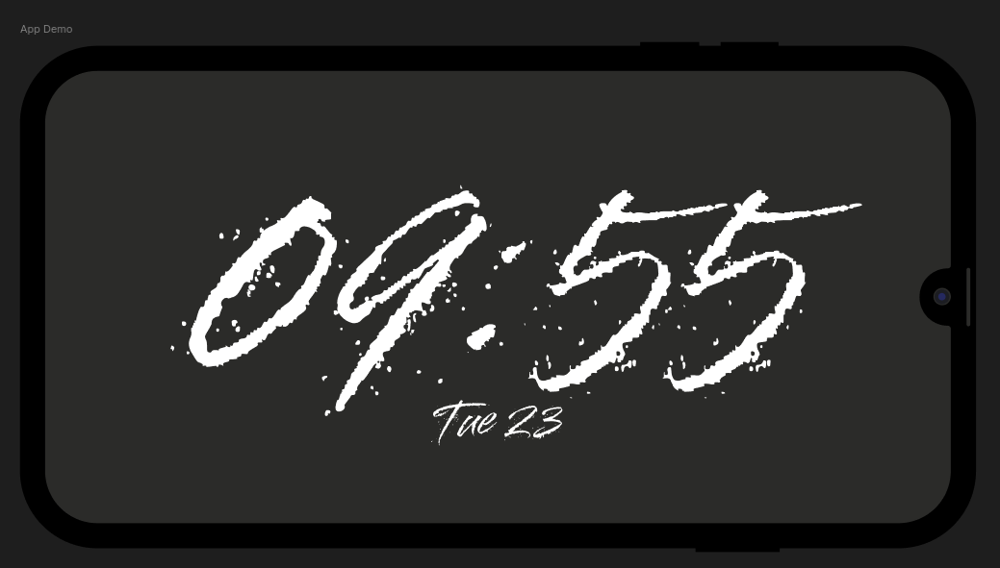

# My Clock

A simple, ad-free clock app designed to turn your phone into a beautiful bedside clock.

## About

I love using my phone as a clock — the AMOLED screen looks gorgeous with a minimal clock display. But every app I tried was cluttered with ads, which completely ruins the experience.

So I built my own.

**My Clock** is a lightweight Flutter app that displays the time in landscape mode with a wakelock enabled, keeping your screen on without interruption.

## Screenshot

## Planned Features

- Landscape-only display
- Wakelock to prevent screen timeout
- Clean, minimal UI optimized for AMOLED screens

## Future Plans

Once complete, I'll release:
- **Source code** — so anyone can customize it to their liking
- **APK** — for direct installation

If there's enough interest, I may also publish it to the Google Play Store.

I'm not planning to actively maintain this repo for feature requests, but if contributions come in, I'm happy to help where I can.

I have a few more app ideas in the pipeline too — stay tuned!

## License

This project is licensed under the [MIT License](LICENSE).